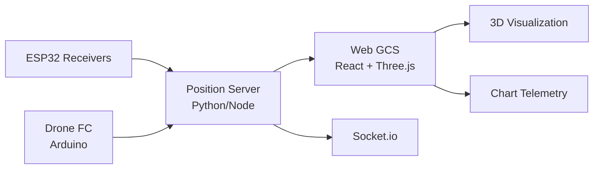

  

      

  <b>Low-cost motion capture system for autonomous indoor drone flight</b>

---

## 🛸 Overview

A complete indoor motion capture system using ESP32 receivers, a flight controller, and a React+Three.js web interface with computer vision for autonomous drone tracking.

---

## 🛠️ Architecture

---

## 📁 Components

| Component | Tech | Role |
|-----------|------|------|
| Receivers | ESP32 / Arduino | Signal capture |
| Computer Vision | Python | Position tracking |
| GCS | React + Three.js | 3D visualization & control |
| Comms | Socket.io | Real-time data |

---

## 🚀 Tech Stack

      

---

  

